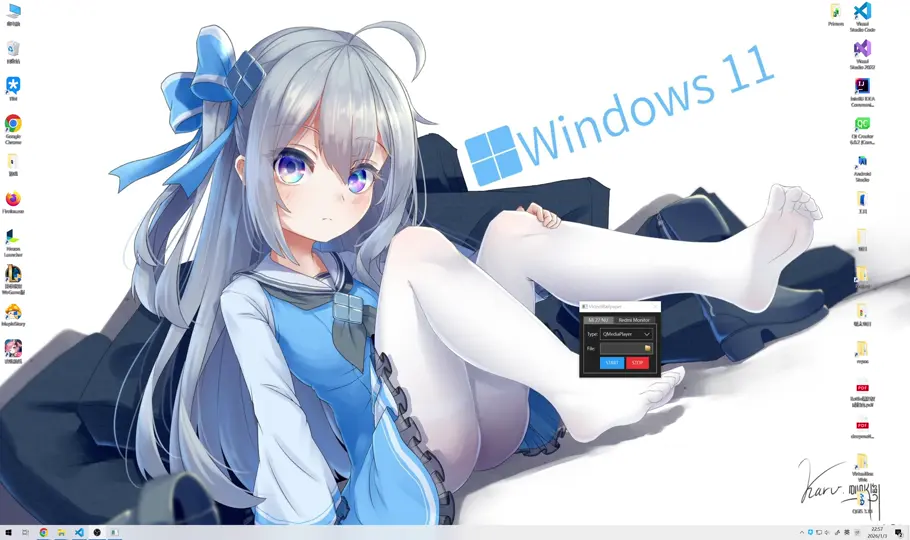

# VideoWallpaper

Video wallpaper software on Windows.

## Note

* [`VLC`](https://github.com/videolan/vlc) & [`MPV`](https://github.com/mpv-player/mpv) are not bundled together; please install them and add them to your PATH environment variable.
* The built-in player (`QMediaPlayer`) is not compatible with versions of Windows 11 24H2 and later.